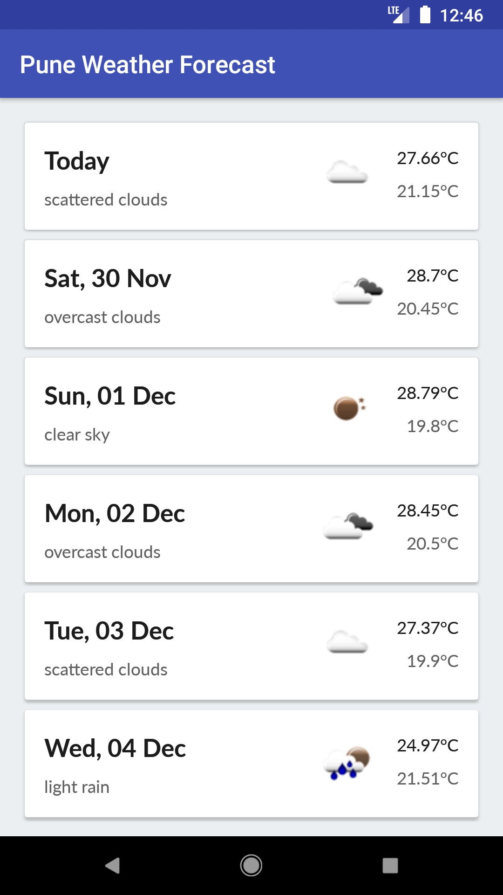

# AIB-Exercise
AIB Android Coding Assessement

Introduction
------------
An Android coding assessement app illustrating 5days weather forecast for Pune city.

Getting Started
---------------
This project uses the Gradle build system. To build this project, use the
`gradlew build` command or use "Import Project" in Android Studio.

There are two Gradle tasks for testing the project:
* `connectedAndroidTest` - for running Espresso on a connected device
* `test` - for running unit tests

Screenshots
-----------

Libraries Used
--------------

* [Architecture][0] - A collection of libraries that help you design robust, testable, and
  maintainable apps.
  * [LiveData][1] - Build data objects that notify views when the underlying database changes.
  * [ViewModel][2] - Store UI-related data that isn't destroyed on app rotations. Easily schedule
     asynchronous tasks for optimal execution.
* [UI][3] - Details on why and how to use UI Components in your apps - together or separate
  * [Fragment][4] - A basic unit of composable UI.
* Third party
  * [Retrofit][5] for network operation
  * [Dagger2][6] for dependancy injection
  * [RxKotlin][7] for managing background threads with simplified code and reducing needs for callbacks
  * [Glide][8] for image loading

[0]: https://developer.android.com/jetpack/arch/
[1]: https://developer.android.com/topic/libraries/architecture/livedata
[2]: https://developer.android.com/topic/libraries/architecture/viewmodel
[3]: https://developer.android.com/guide/topics/ui
[4]: https://developer.android.com/guide/components/fragments
[5]: https://github.com/square/retrofit
[6]: https://github.com/google/dagger
[7]: https://github.com/ReactiveX/RxKotlin
[8]: https://developer.android.com/guide/topics/ui

Upcoming features
-----------------
Updates will include incorporating additional weather data for particular day and updating UI.

Android Studio IDE setup
------------------------
For development, the latest version of Android Studio is required. The latest version can be
downloaded from [here](https://developer.android.com/studio/).

Author
------------------------
* **Devdatta Chandsarkar**
